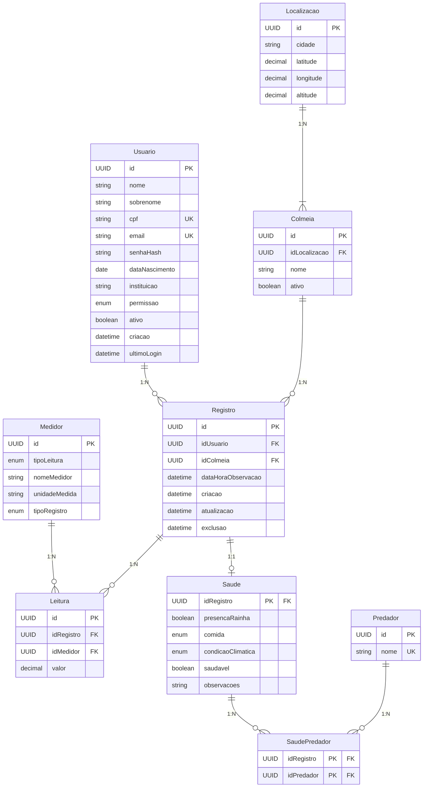

```mermaid
erDiagram
    Usuario {
        UUID id PK
        string nome
        string sobrenome
        string cpf UK
        string email UK
        string senhaHash
        date dataNascimento
        string instituicao
        enum permissao
        boolean ativo
        datetime criacao
        datetime ultimoLogin
    }

    Localizacao {
        UUID id PK
        string cidade
        decimal latitude
        decimal longitude
        decimal altitude
    }

    Colmeia {
        UUID id PK
        UUID idLocalizacao FK
        string nome
        boolean ativo
    }

    Registro {
        UUID id PK
        UUID idUsuario FK
        UUID idColmeia FK
        datetime dataHoraObservacao
        datetime criacao
        datetime atualizacao
        datetime exclusao
    }

    Medidor {
        UUID id PK
        enum tipoLeitura
        %% umidade interna, temperatura externa, etc.
        string nomeMedidor
        %% se for manual nome fica em branco
        string unidadeMedida
        enum tipoRegistro
        %% manual ou automatico
    }

    Leitura {
        UUID id PK
        UUID idRegistro FK
        UUID idMedidor FK
        decimal valor
        %% decimal temperaturaInterna
        %% decimal temperaturaExterna
        %% decimal umidadeInterna
        %% decimal umidadeExterna
        %% decimal pressaoAtmosferica
        %% decimal velocidadeVento
        %% decimal peso
    }

    Saude {
        UUID idRegistro PK "FK"
        boolean presencaRainha
        enum comida
        enum condicaoClimatica
        boolean saudavel
        string observacoes
    }

    Predador {
        UUID id PK
        string nome UK
    }

    SaudePredador {
        UUID idRegistro PK "FK"
        UUID idPredador PK "FK"
    }

    Usuario ||--o{ Registro : "1:N"
    Localizacao ||--|{ Colmeia : "1:N"
    Colmeia ||--o{ Registro : "1:N"
    Medidor ||--o{ Leitura : "1:N"
    Registro ||--o{ Leitura : "1:N"
    Registro ||--o| Saude : "1:1"
    Saude ||--o{ SaudePredador : "1:N"
    Predador ||--o{ SaudePredador : "1:N"
```
