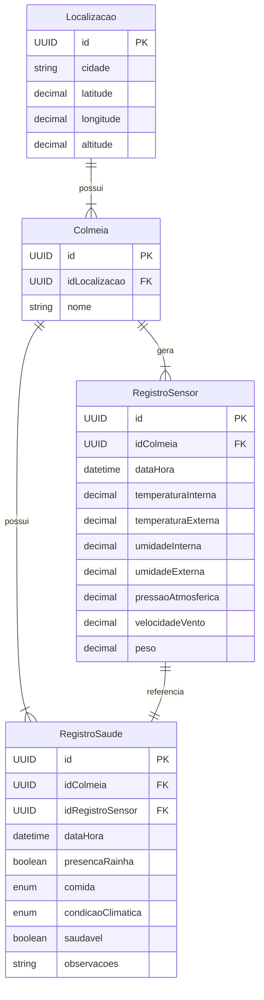

```mermaid
erDiagram

    Localizacao {
        UUID id PK
        string cidade
        decimal latitude
        decimal longitude
        decimal altitude
    }

    Colmeia {
        UUID id PK
        UUID idLocalizacao FK
        string nome
    }

    RegistroSensor {
        UUID id PK
        UUID idColmeia FK
        datetime dataHora
        decimal temperaturaInterna
        decimal temperaturaExterna
        decimal umidadeInterna
        decimal umidadeExterna
        decimal pressaoAtmosferica
        decimal velocidadeVento
        decimal peso
    }

    RegistroSaude {
        UUID id PK
        UUID idColmeia FK
        UUID idRegistroSensor FK
        datetime dataHora
        boolean presencaRainha
        enum comida
        enum condicaoClimatica
        boolean saudavel
        string observacoes
    }

    Localizacao ||--|{ Colmeia : possui
    Colmeia ||--|{ RegistroSensor : gera
    Colmeia ||--|{ RegistroSaude : possui
    RegistroSensor ||--|| RegistroSaude : referencia

```
