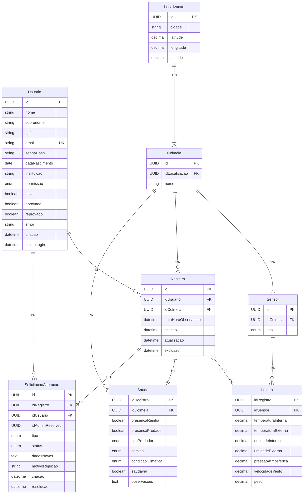

```mermaid
erDiagram

    Usuario {
        UUID id PK
        string nome
        string sobrenome
        string cpf
        string email UK
        string senhaHash
        date dataNascimento
        string instituicao
        enum permissao
        boolean ativo
        boolean aprovado
        boolean reprovado
        string emoji
        datetime criacao
        datetime ultimoLogin
    }

    Localizacao {
        UUID id PK
        string cidade
        decimal latitude
        decimal longitude
        decimal altitude
    }

    Colmeia {
        UUID id PK
        UUID idLocalizacao FK
        string nome
    }

    Sensor {
        UUID id PK
        UUID idColmeia FK
        enum tipo
    }

    Registro {
        UUID id PK
        UUID idUsuario FK
        UUID idColmeia FK
        datetime dataHoraObservacao
        datetime criacao
        datetime atualizacao
        datetime exclusao
    }

    Leitura {
        UUID idRegistro PK
        UUID idSensor FK
        decimal temperaturaInterna
        decimal temperaturaExterna
        decimal umidadeInterna
        decimal umidadeExterna
        decimal pressaoAtmosferica
        decimal velocidadeVento
        decimal peso
    }

    Saude {
        UUID idRegistro PK
        UUID idColmeia FK
        boolean presencaRainha
        boolean presencaPredador
        enum tipoPredador
        enum comida
        enum condicaoClimatica
        boolean saudavel
        text observacoes
    }

    SolicitacaoAlteracao {
        UUID id PK
        UUID idRegistro FK
        UUID idUsuario FK
        UUID idAdminResolveu
        enum tipo
        enum status
        text dadosNovos
        string motivoRejeicao
        datetime criacao
        datetime resolucao
    }

    Localizacao ||--|{ Colmeia : "1:N"
    Colmeia ||--|{ Sensor : "1:N"
    Usuario ||--o{ Registro : "1:N"
    Colmeia ||--o{ Registro : "1:N"
    Registro ||--o| Leitura : "1:0..1"
    Registro ||--|| Saude : "1:1"
    Sensor ||--o{ Leitura : "1:N"
    Colmeia ||--o{ Saude : "1:N"
    Registro ||--o{ SolicitacaoAlteracao : "1:N"
    Usuario ||--o{ SolicitacaoAlteracao : "1:N"
```
