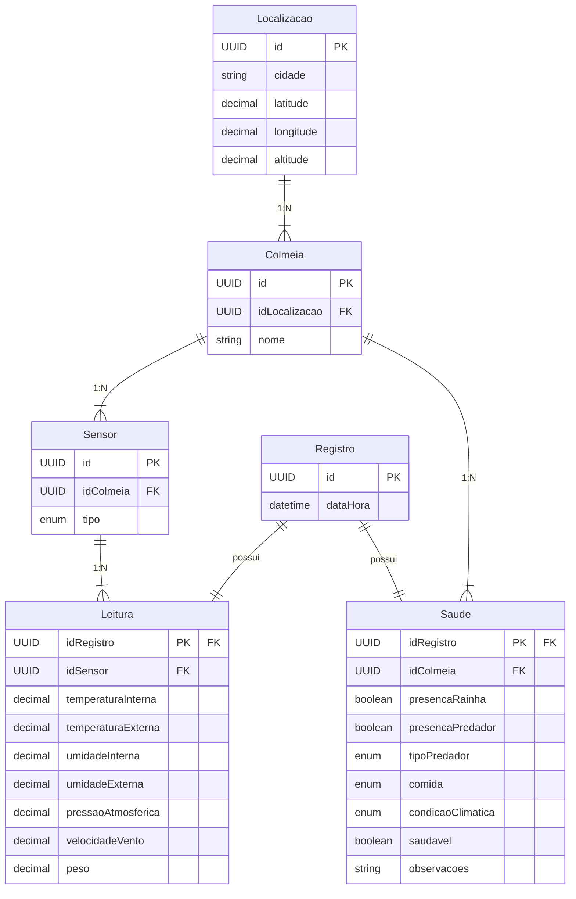

```mermaid
erDiagram

    Localizacao {
        UUID id PK
        string cidade
        decimal latitude
        decimal longitude
        decimal altitude
    }

    Colmeia {
        UUID id PK
        UUID idLocalizacao FK
        string nome
    }

    Sensor {
        UUID id PK
        UUID idColmeia FK
        enum tipo
    }

    Registro {
        UUID id PK
        datetime dataHora
    }

    Leitura {
        UUID idRegistro PK "FK"
        UUID idSensor FK
        decimal temperaturaInterna
        decimal temperaturaExterna
        decimal umidadeInterna
        decimal umidadeExterna
        decimal pressaoAtmosferica
        decimal velocidadeVento
        decimal peso
    }

    Saude {
        UUID idRegistro PK "FK"
        UUID idColmeia FK
        boolean presencaRainha
        boolean presencaPredador
        enum tipoPredador
        enum comida
        enum condicaoClimatica
        boolean saudavel
        string observacoes
    }

    Localizacao ||--|{ Colmeia : "1:N"
    Colmeia ||--|{ Sensor : "1:N"
    Sensor ||--|{ Leitura : "1:N"
    Colmeia ||--|{ Saude : "1:N"
    Registro ||--|| Leitura : possui
    Registro ||--|| Saude : possui

```
